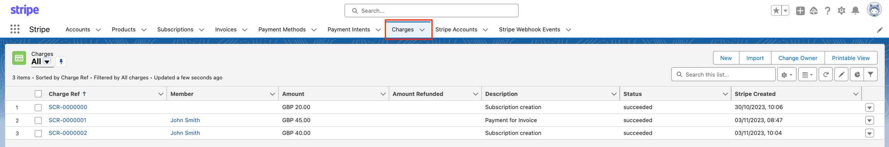
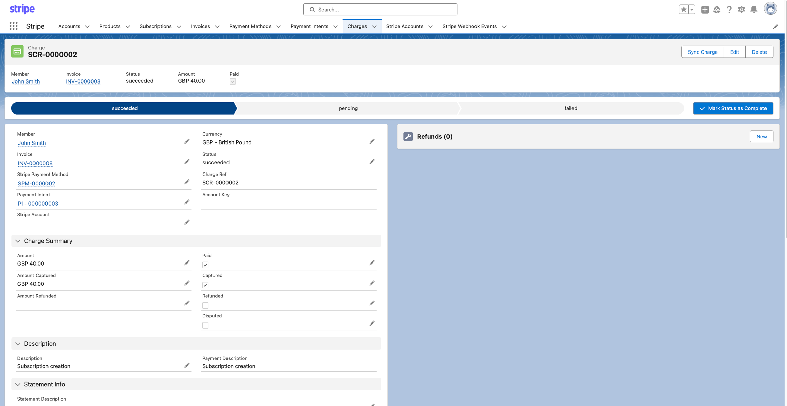
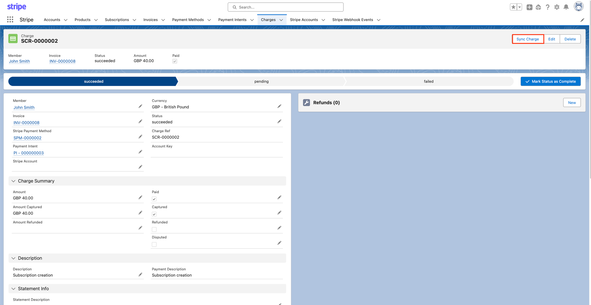

# Charges

The charge object represents a single attempt to move money into your Stripe account. A PaymentIntent confirmation is the most common way to create Charges. The Charge object includes information relating to the amount, currency, customer, and payment method.&#x20;

Using Stripe for Salesforce app to sync your charges from Stripe to Salesforce, keeps track of all charges, transactions and statuses inside your Salesforce org.

## **Charges in the Stripe for Salesforce app**

Charges are read-only records that are provided to the user to highlight every individual transaction.&#x20;

You can find the Charges located under the **Charge** object in the Stripe for Salesforce application. The Charge's list view, provides information such as the ***SCR-xxxxxx*** (*Stripe Charge record name*), the amount, the amount refunded, the transaction description, the status and the charge creation date and time.

Clicking on the name of one of the charge opens up the record for further inspection.&#x20;

In the record we see the similar information as the list view but also information about the transaction amounts, any further Stripe IDs for reference, and any relevant records of refunds.

## Sync Charges from Stripe

If you need to manually sync your payment intents from Stripe, without waiting for the webhooks to automatically complete that, you will need to navigate to the charge record and locate and click the action button **Charge**. This will pull the data from Stripe to your Salesforce org. testtesttest

## Charges Statuses

In the table below you will see a list of statuses used by the Stripe for Salesforce application and Stripe regarding charges, as well as a description of the status.&#x20;

| Charge Status | Description                                                                                                                                                                                                                                     |
| ------------- | ----------------------------------------------------------------------------------------------------------------------------------------------------------------------------------------------------------------------------------------------- |
| `Succeeded`   | 
A charge status of s<code>ucceeded</code> occurs when a transaction instance has added funds to your account.  Or refunds, once the refund has been processed and left your account and reached the customer's payment instrument.
 |
| `Pending`     | A charge status of `pending` occurs when there is a delay to the capturing of funds or releasing the funds for refunds.                                                                                                                         |
| `Failed`      | A charge of status of `failed` occurs when the transaction has failed, been cancelled or interrupted.                                                                                                                                           |
