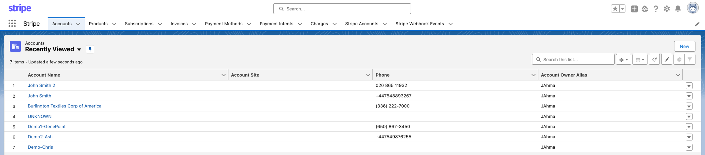

# Documentation and UI overview

## Documentation

This document aims to provide users with goal-orientated information for actions within an implemented version of the Stripe for Salesforce app.

We provide you guided steps to use Stripe for Salesforce to the best of its ability and with the greatest of ease. For example, in the ***Customer accounts*** page we will walk you through adding new contacts Salesforce and syncing these to Stripe, or in ***Refunds*** you will be shown how and where to generate a refund to your customer.

For further information on using the Stripe for Salesforce app, any in-depth training questions, issues or installation requirements you can contact the team at <support@gazela.io> .

## User Interface

Once the Stripe for Salesforce app is correctly implemented on your Salesforce organisation, you will be able to see all the tabs and objects related to Stripe.&#x20;

To view these, first we need to launch the Stripe for Salesforce app. Click on the  to open the app manager and search for the Stripe for Salesforce app.

Once you load the Stripe for Salesforce app, you will see that the app includes the following Standard Salesforce objects; Accounts and Products. As well as custom Stripe objects; such as payment methods, invoices, subscriptions, payment intents, charges, Stripe accounts and Stripe Webhook events. All of which are Stripe event objects used to sync actions between the two systems.
