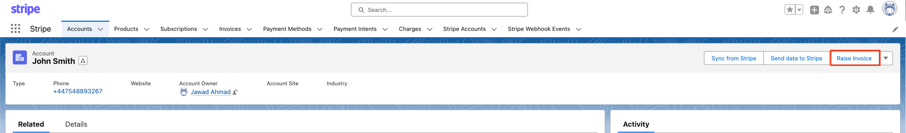
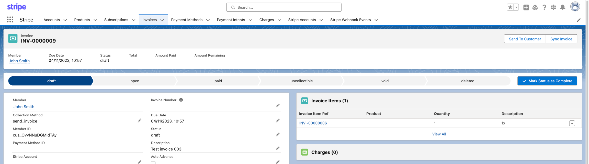
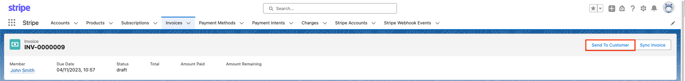
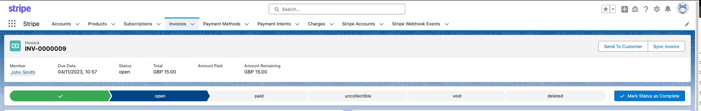
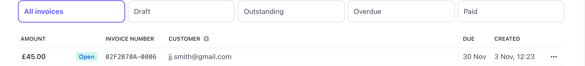
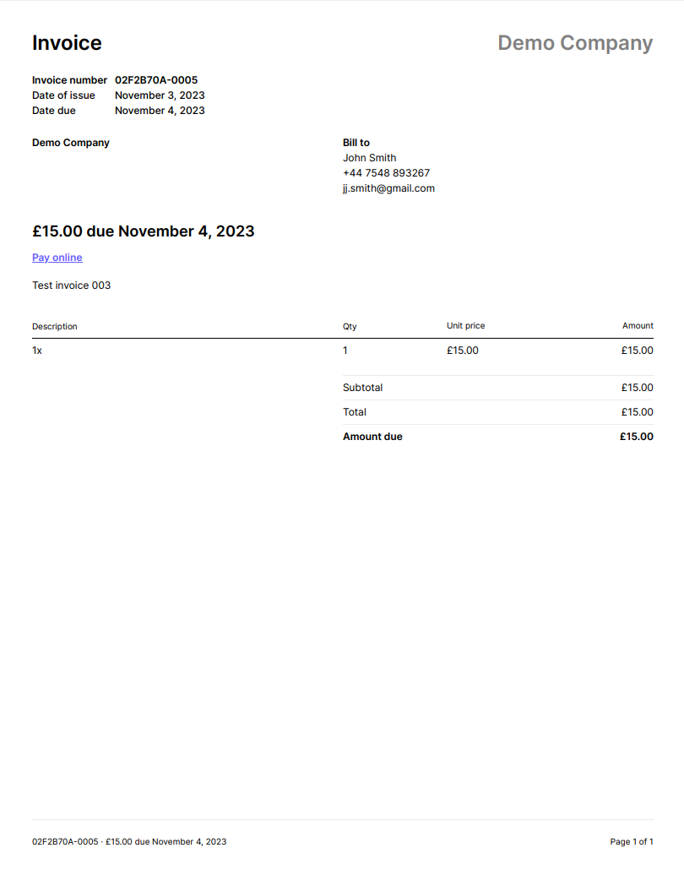
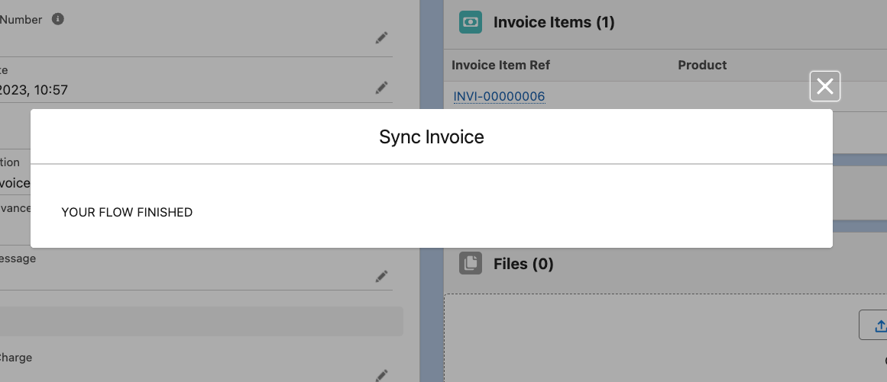
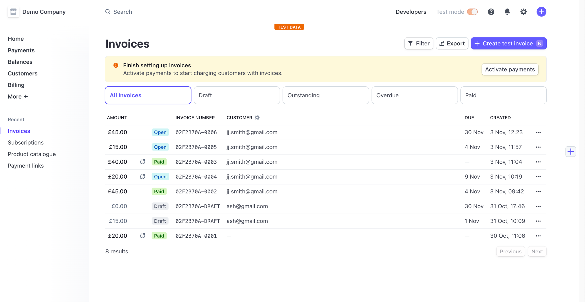

# Invoices

In the Stripe for Salesforce app, invoices can be sent to customers directly from a Salesforce org. Users are able to generate and send new invoices to customers, alongside update record the updates to the invoice status or stages within Salesforce. The updates to this workflow will then also be synced with Salesforce.

## Invoice generation

To generate a new invoice for a customer, the user must first navigate to the Customer Account. From here the user will need to locate and click the **Raise Invoice** action button on the page layout.

Next fill in the form fields with the information required for this invoice. Start by adding a description and due date.

On the next window select the product.

And, finally add the price and quantities for the invoice. Here the user also can choose to add more items to the invoice by click the box for **Create More Items**, this will then take the user back to the first model window to input their invoice line item information.

Once this is is completed, the user can navigate to the invoice record and see the invoice in its draft form. This can be edited and revised before being sent to the customer and Stripe.

## Send the invoice to your customer

Once the user has generated an invoice and is ready to send it to the customer they will need to: navigate to the invoice record and select the **Send To Customer** action button on the page layout. Clicking the **Send To Customer** initiates the process in which Salesforce tells Stripe to send the invoice to the customer.

Upon completing this action the status of the *draft* invoice is then changed to **Open**. As you'll see here the invoice status is reflected within both Salesforce and the Stripe dashboard.&#x20;

The customer will then receive an invoice with a payment link to a hosted payment page, where payment information can be entered. &#x20;

*Emailed invoice and payment link example:*

*Hosted payment page example:*

##

## Manual syncing invoice data from Stripe

Here we will discuss how to sync an invoice record from Salesforce to Stripe. This is normally done through the integrated webhooks, but if you need to do this manually please follow these instructions.

To send this invoice to Stripe, click on the **sync invoice** action button in the Product record. You will then be shown a completion message.

Then if you check your Stripe dashboard in the Invoices section you will see and updated list of Invoices and invoice payment statuses.

