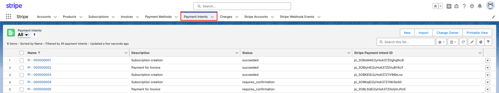
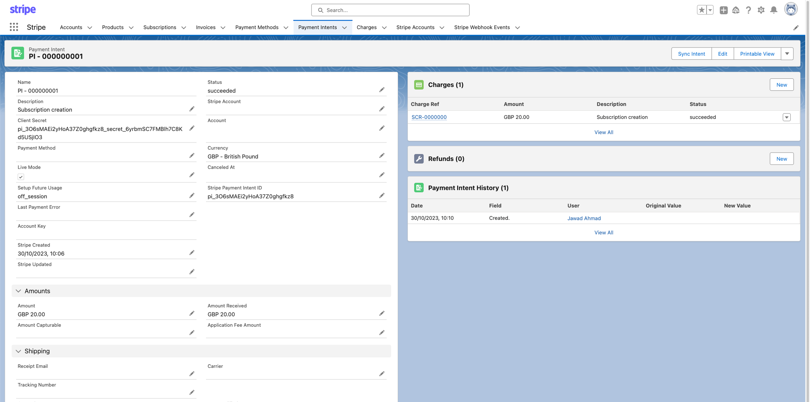
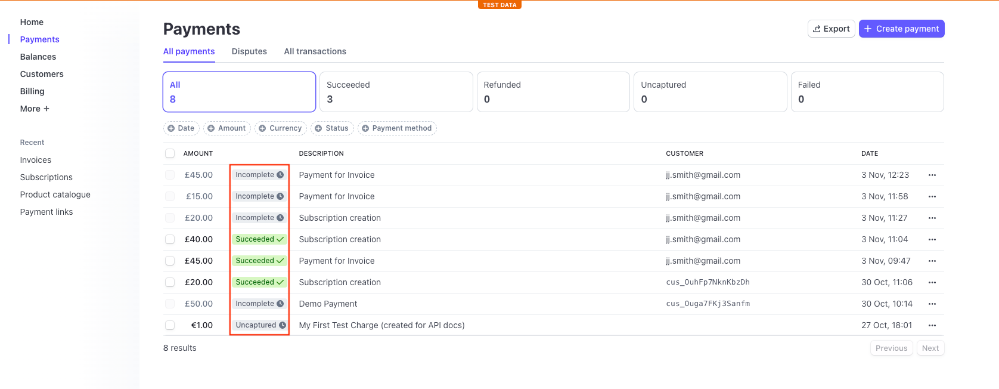
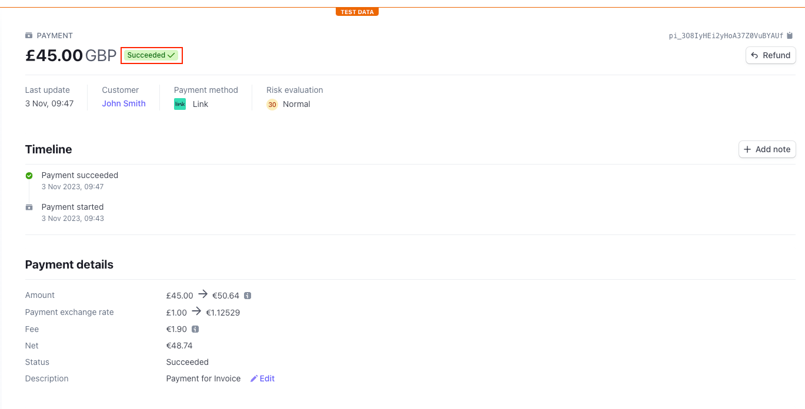
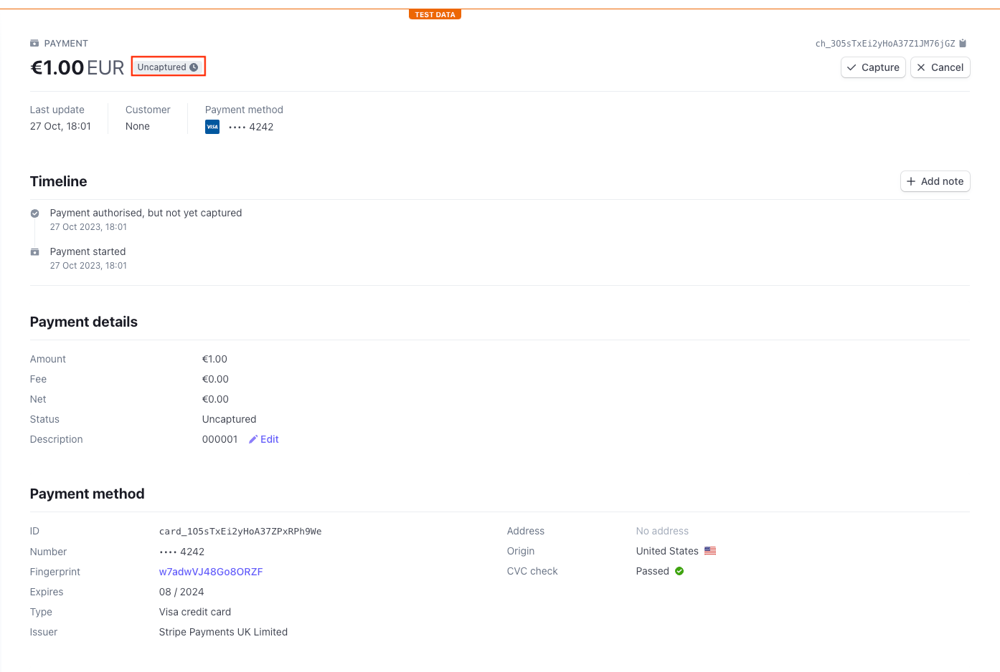
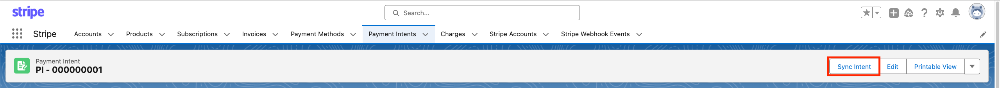

# Payment intents

A PaymentIntent serves as a roadmap for securing a payment from your customer. Throughout its journey, a PaymentIntent progresses through various stages while interacting with Stripe.js to conduct authentication procedures, culminating in the creation of a single successful transaction at most.

!!! info 
    **NOTE**: If you want to take payments from Salesforce, you need to use it with Stripe.Js to be PCI compliant.

## **Payment intents in Stripe app for salesforce**

PaymentIntents are read-only records that are provided to the user to highlight the status of each individual transaction.&#x20;

You can find the Stripe for Salesforce PaymentIntents located under the **Payment Intents** object in the Stripe for Salesforce application. In the list view will provide information such as the ***PI-xxxxxx*** (*payment intent record name*), the transaction description, the PaymentIntent status and the Stripe Payment Intent ID.

Clicking on the name of one of the Payment Intent opens up the record for further inspection. In the record we see the similar information as the list view but also information about the transaction amounts, any further Stripe IDs for reference, the charge that was made to the customer's payment method, alongside any refunds and Payment Intent History.

## Verifying the PaymentIntent status with Stripe

To verify the status of the transactions in the Stripe for Salesforce application you can go to your Stripe Dashboard > payments.&#x20;

As you can see here the status of the payment is recorded on both the list view in the Stripe dashboard and in the individual timeline of each stripe payment record (*below)*.

## Sync Intent from Stripe

If you need to manually sync your payment intents from Stripe, without waiting for the webhooks to automatically complete that, you will need to navigate to the paymentintent record and locate and click the action button **Sync Intent**. This will pull the data from Stripe to your Salesforce org.

## PaymentIntents Statuses

In the table below you will see a list of statuses used by the Stripe for Salesforce application and Stripe regarding payment intents, as well as a description of the status.&#x20;

| PaymentIntent Status      | Description                                                                                                                                                                                                                                                                                                                                                                                                                                                                                                            |
| ------------------------- | ---------------------------------------------------------------------------------------------------------------------------------------------------------------------------------------------------------------------------------------------------------------------------------------------------------------------------------------------------------------------------------------------------------------------------------------------------------------------------------------------------------------------- |
| `Requires_payment_method` | 
A PaymentIntent with the status <code>requires/_payment/_method</code> indicates that the payment flow has been created and requires a payment method to be attached.  If the payment attempt fails (for example due to a decline), the PaymentIntent’s status returns to <code>requires/_payment/_method</code> so that the payment can be retried.
                                                                                                                                                      |
| `Requires_confirmation`   | 
A PaymentIntent with the status of <code>requires/_confirmation</code> occurs once the customer has entered payment information.   This indicates that the PaymentIntent is ready to be confirmed.
                                                                                                                                                                                                                                                                                                        |
| `Requires_action`         | If a PaymentIntent has the `requires_action` status this indicates that the payment requires additional authentication with 3D Secure.                                                                                                                                                                                                                                                                                                                                                                                 |
| `Requires-capture`        | 
A PaymentIntent with the status of <code>requires/_capture</code> instructs Stripe to authorise the amount from the payment method but not to capture the funds. Authorising a payment guarantees the amount by holding it on the customer’s payment method.   If successful this moves the PaymentIntent status to <code>processing</code>.  <em><strong>Example</strong>: hotels often authorise a payment in full before a guest arrives, then capture the money when the guest checks out.</em>
 |
| `Processing`              | 
Once all required actions are handled, the PaymentIntent status will be moved to <code>processing</code> .   Processing times may vary depending on payment method.
                                                                                                                                                                                                                                                                                                                                       |
| `Succeeded`               | 
A PaymentIntent that has the status <code>succeeded</code> refers to the payment flow being complete. 

 Funds will now have left the customer's payment method and will now be in your account. 
                                                                                                                                                                                                                                                                                                       |
| `Cancelled`               | 
The <code>cancelled</code> status can occur at any stage before <code>processing</code> or <code>succeeded</code>.   If a PaymentIntent has the status <code>cancelled</code> becomes invalidated and cannot be used for future payment attempts.    Any funds being held i.e., status: <code>requires/_capture</code> are released when the status updates to cancelled. 
                                                                                                                          |

 
