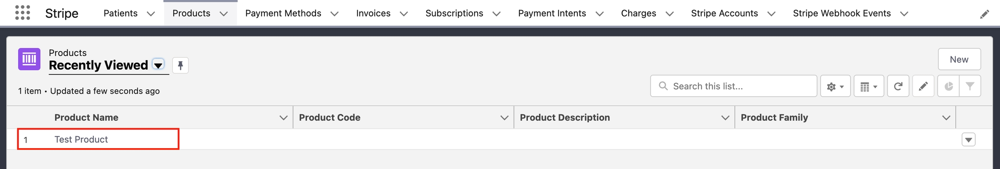
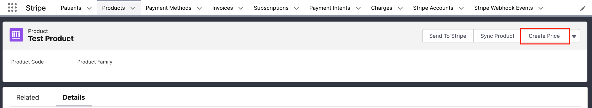
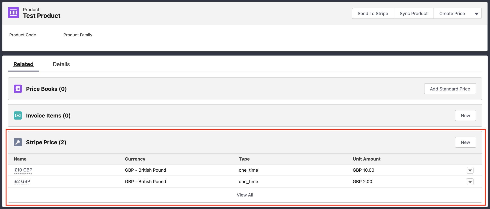
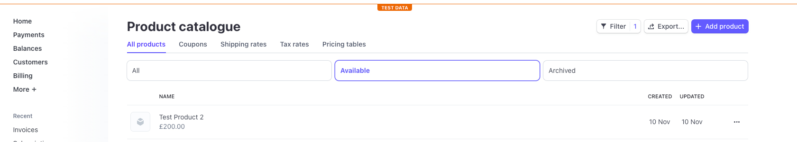
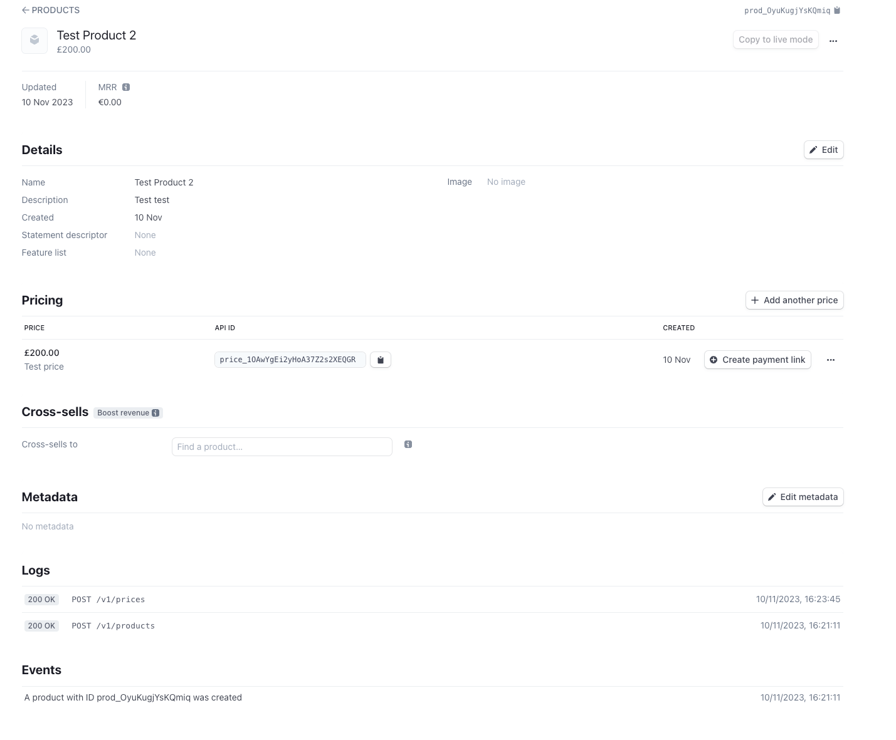

# Prices

The Stripe price object is like a product's price tag. It includes info like the price's amount, currency, recurring billing info, and usage type. There are two types of prices in Stripe: one-time prices and recurring prices. Price data in Stripe is mapped to a custom object in Salesforce.

!!! info 
    **Note**: The Stripe for Salesforce app only lets you add one-time prices from Salesforce. If you want to add recurring prices, you'll need to do it in Stripe and then sync it back to Salesforce. Tier-based pricing isn't supported in the current Stripe for Salesforce app.

## Create a price from Salesforce:

To create a price for a Product in the Stripe app for Salesforce, firstly go to the Product object and select a Product record.

*Product record > Create price action button*

Next we go to the create price action button on the record layout. Next fill in the form fields with the information required and click save. This sends and syncs the information to Stripe.

We can then view the related tab on the product record to see the prices attributed to this product record.

*Product record > related > Stripe prices for the product record*

## **Manual Syncing Products From Stripe**

Here we will discuss how to sync a product's price record from Salesforce to Stripe. This is normally done through the integrated webhooks, but if you need to do this manually please follow these instructions.

To send this product information to Stripe, click on the **Sync Pice** action button in the Product record page layou&#x74;**.** If you go to the product catalogue of the Stripe dashboard, you'll be able to see that your product has an associated price. Entering the product catalogue record in Stripe will give you further information about when the price was added to the product.

