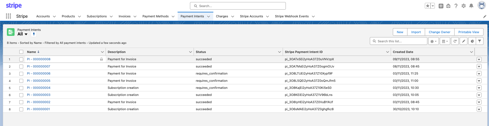
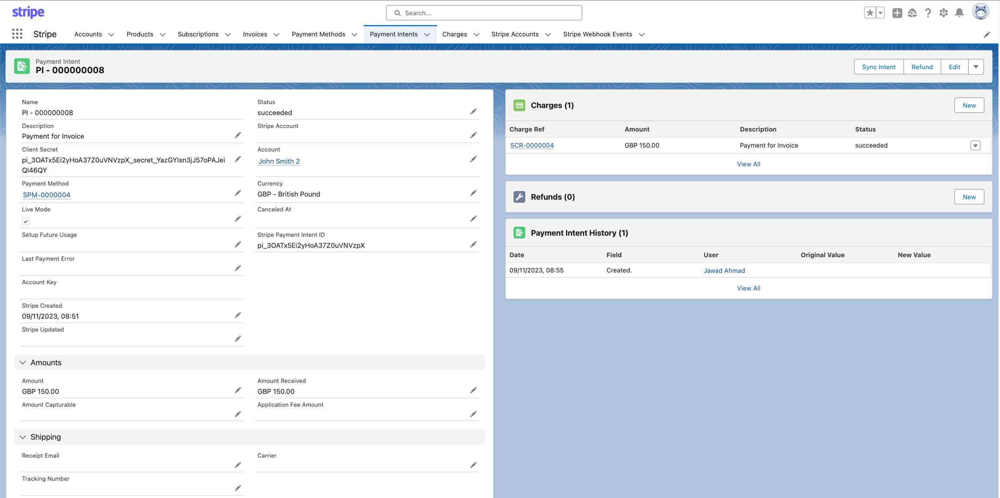
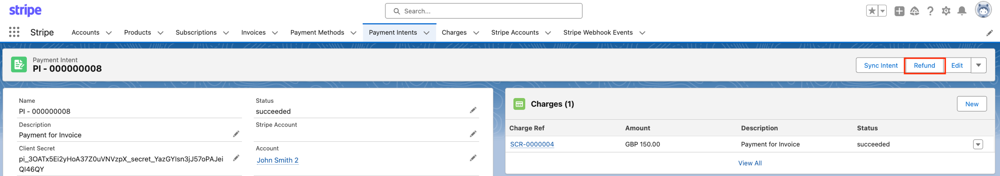
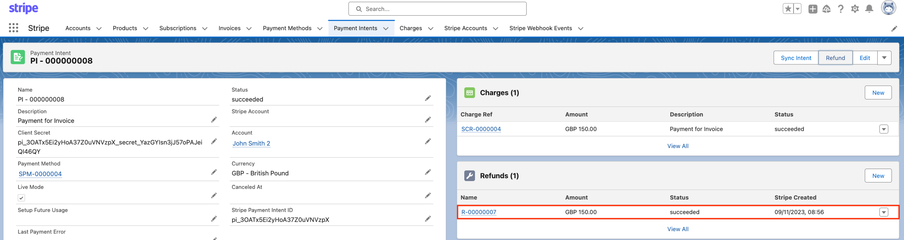
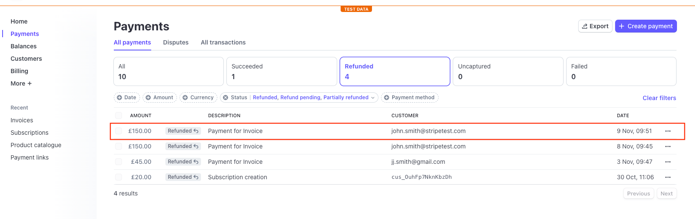
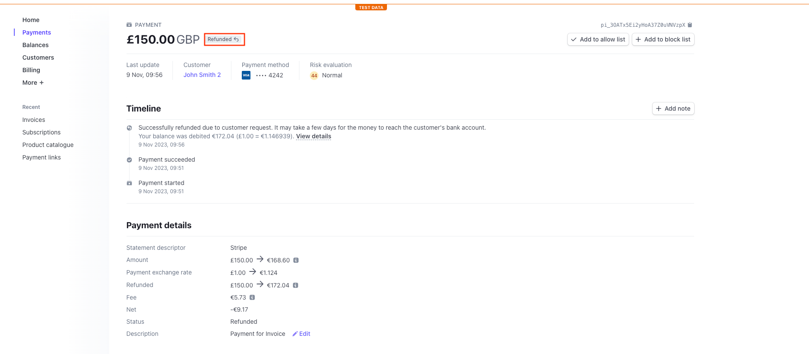

# Refunds

In the Stripe for Salesforce app, refunds can be sent to customers directly from a Salesforce org. Users are able to generate and send refunds to customers, alongside update the payment intents and charge records. The updates to this workflow will then also be synced with Stripe.

## Refund generation

To generate a refund to a customer, the user must first navigate to the Payment intent tab. From here the user will need to select a payment intent record from which the refund will be sent.&#x20;

Next locate and click the **Refund** action button on the page layout.

Clicking the refund action button opens a modal window in Salesforce. The amount is populated from the succeeded payment from the customer - this is editable by clicking into the form field and changing the numerical amount.&#x20;

Next we need to select a reason for the refund, this is done by clicking into the reason form field. One the reason has been confirmed, click next and the refund will be processed.&#x20;

Coming back to the payment intent record, we can see the refund is succeeded.

## Verifying Refunds in the Stripe Dashboard

To verify the status of the refund in the Stripe for Salesforce application you can go to your Stripe Dashboard > payments.&#x20;

As you can see here the status of the refund is recorded on both the list view in the Stripe dashboard and in the individual timeline of each Stripe payment record (*below)*.

