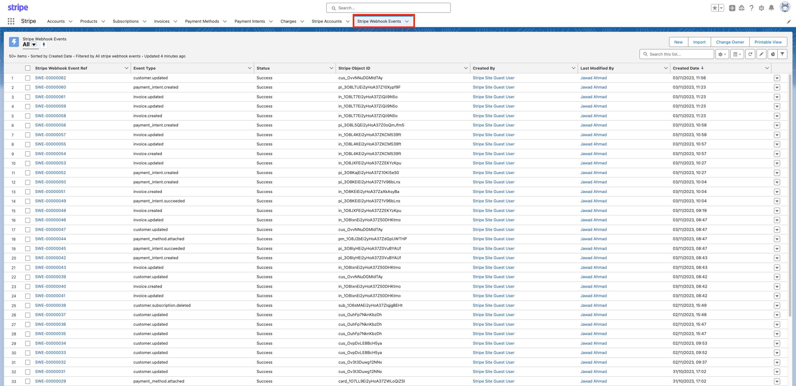
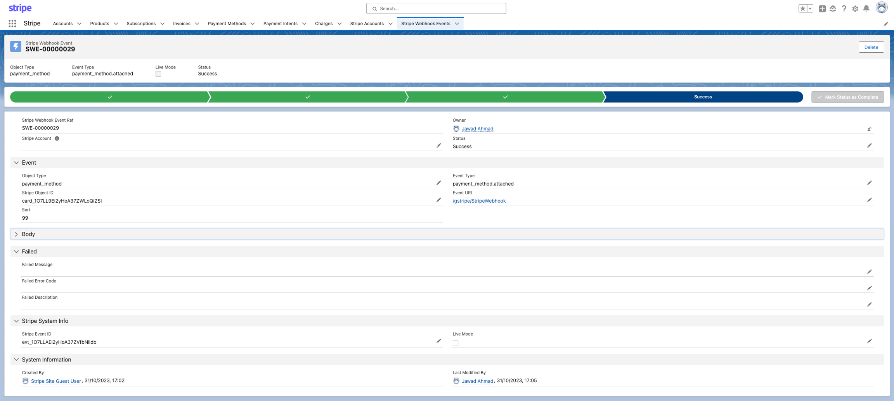

# Stripe webhook events

Webhooks are automated messages sent from applications when something happens. They're a way for different software systems, in our case Stripe and Salesforce, to communicate with each other in real-time. Essentially, a webhook sends a signal to another system or server over the web, which typically carries with it a payload of data.&#x20;

In Stripe for Salesforce, the API calls are made automatically; we can view the log of all webhooks as they sync and send data between Stripe and Salesforce. If there is ever a problem, or you don't think a data in being transferred between the two systems, this is where you can view the data exchanges.

## Stripe Webhooks Events In Stripe for Salesforce

The webhook events are read-only records that are provided to the user to highlight the status of each exchange of data between Stripe and Salesforce.&#x20;

You can find the Webhook events located under the **Stripe Webhook events** object in the Stripe for Salesforce application. In the webhook events list view will provide information such as the ***SWE-xxxxxx*** (*Stripe webhook event record name*), the event type (*the Stripe event that is called*), the webhook status,the Stripe object ID, and creation and modification dates.

Clicking on the name of one of the Stripe webhook events opens up the record for further inspection. In the record we see the similar information as the list view but also information about the statuses of the webhooks and any webhook failure information.&#x20;

## Stripe Webhook event Statuses

In the table below you will see a list of statuses used by the Stripe for Salesforce application and Stripe regarding Webhook events, as well as a description of the status.&#x20;

| Webhook events statuses | Description                                                                                                                                                                              |
| ----------------------- | ---------------------------------------------------------------------------------------------------------------------------------------------------------------------------------------- |
| `Success`               | A webhook event status of `success` occurs when a an API call is made (*either automatically or manually*) and it returns with a data payload or a status change etc.                    |
| `Failed`                | A webhook event status of `failed` occurs when a an API call is made (*either automatically or manually*) and it does not return with the data payload requested or a status change etc. |
