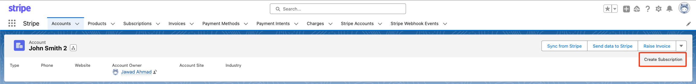
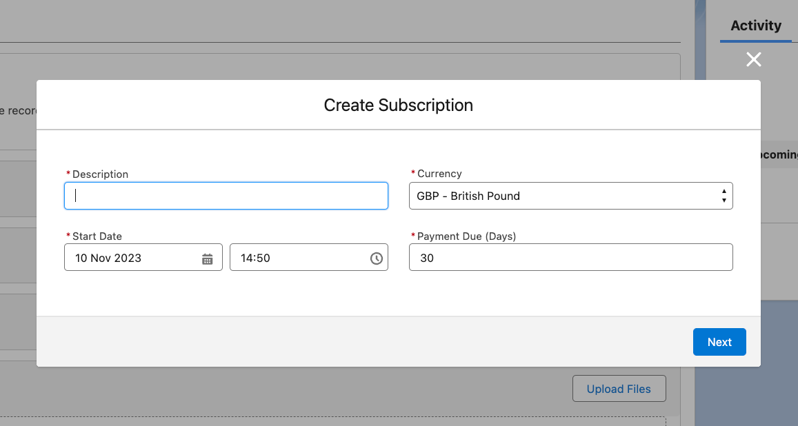
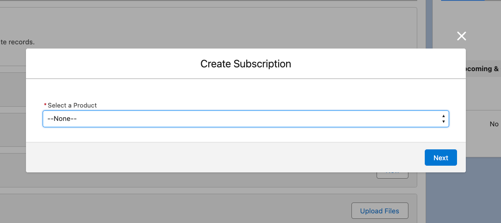
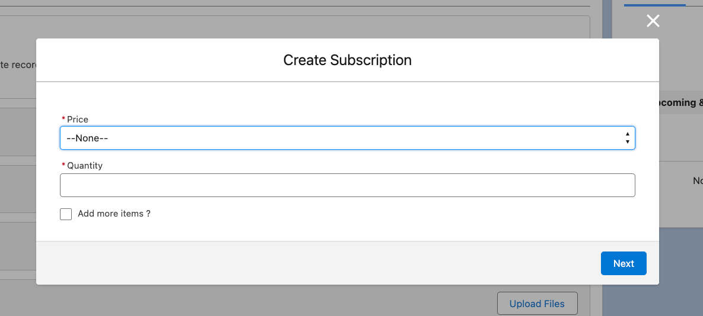
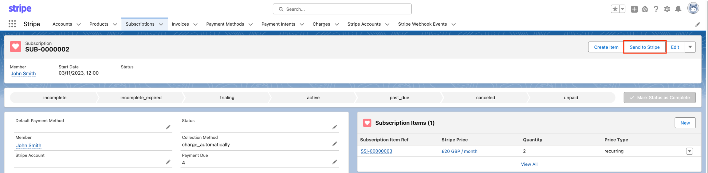
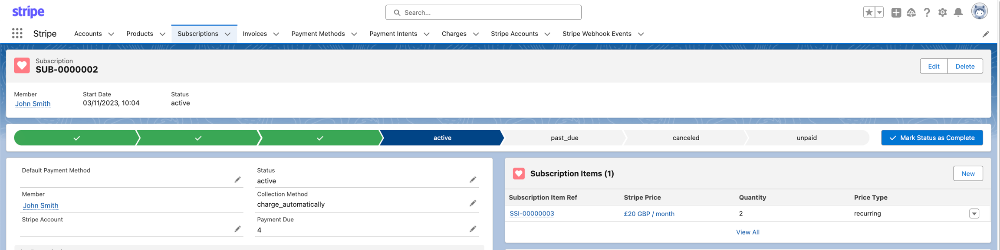
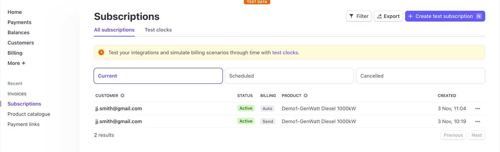

# Subscriptions

Stripe subscriptions are a way to bill your customers on a regular basis. This is a great way to charge for products or services that are delivered over time.&#x20;

The Stripe for Salesforce app can be used to add subscriptions for a customer directly from within Salesforce, so you don't have to switch to Stripe. It can also sync changes from Stripe.

## **Create and set up subscriptions from the Stripe app for Salesforce.**

To create a subscription in Salesforce, go to the Customer Account tab and click on the **Create Subscription** button in the page layout.&#x20;

From here the user will need to fill out the modal window fields. Selecting the product(s), the cost(s) and quantities to add to the subscription.&#x20;

If you don't see the product or price you may need to create or sync a new product and/or price record.&#x20;

Once completed, the subscription record will be updated with the related subscription items, i.e. products and prices.

Navigating to and clicking on the Subscription item record, will display the relevant subscription item information.

## Manual sync subscription to stripe&#x20;

Entering the subscription record, the user is able to manually sync the subscription record to Stripe by clicking on the **Send customer** action button. Completing this step will produce a completion message and you will see a status change to active on the Subscription record.

## Verifying the subscription in Stripe

B.y logging into the Stripe dashboard and navigating to the developer area and clicking on **Subscriptions** on the left hand column. The user can the review the synced subscriptions statuses from this area in the Stripe dashboard.

